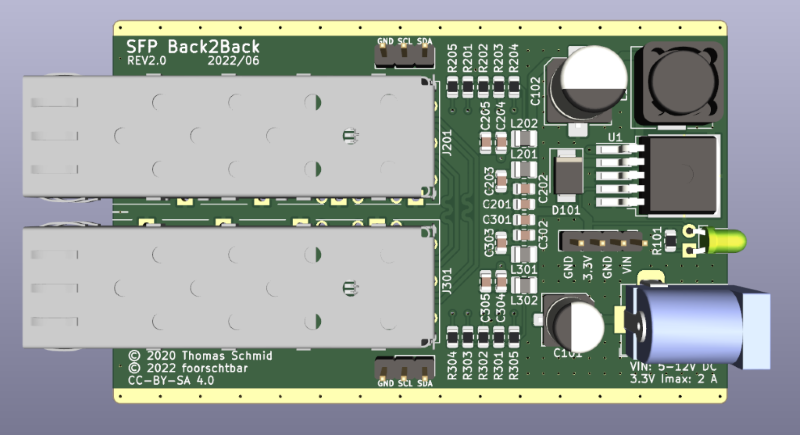
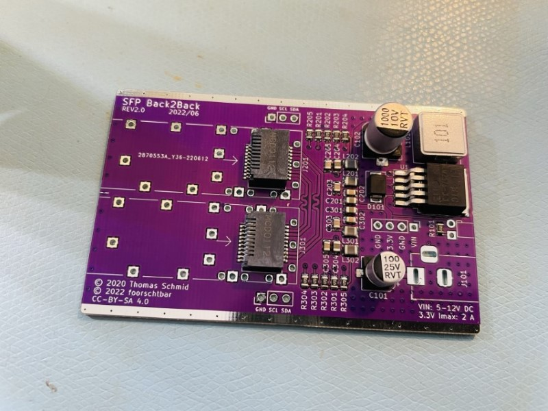
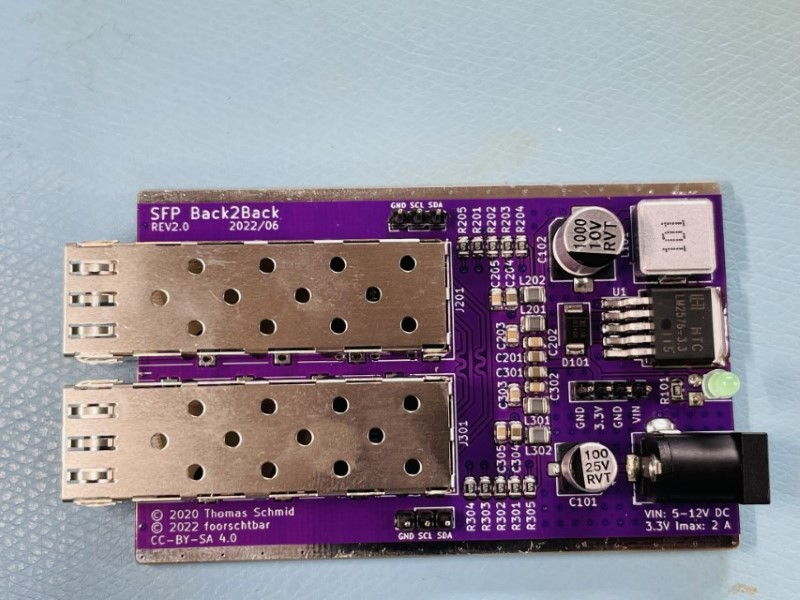
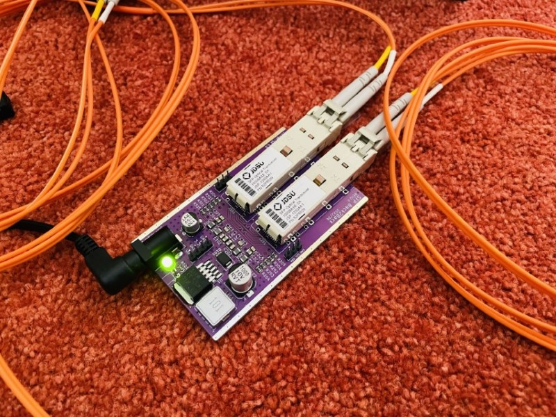
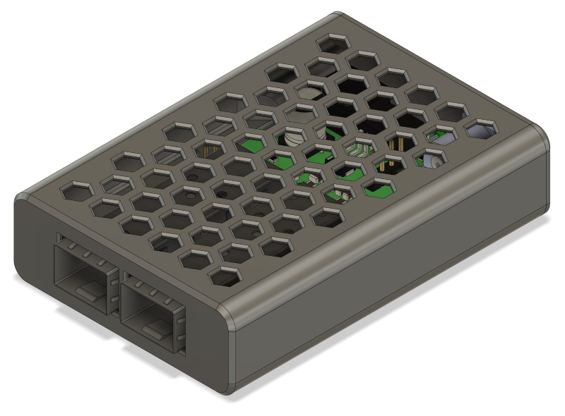

# SFP Back2Back V2

Bridges two small Form-factor Pluggable (SFP, Mini-GBIC) Modules together. This PCB makes it possible, for example, to switch from multi-mode to single-mode if one side has a built-in multi-mode transceiver, the range can be increased with a single-mode connection.  

## PCB

## Case

## Credits

This is a revised version of [git.binary-kitchen.de/tom/sfp_back2back](https://git.binary-kitchen.de/tom/sfp_back2back), because due to the global chip shortage in 2022 a change of the components was necessary. In this same process, small improvements were also made (Routing, I2C Headers, upgrade to 0805).